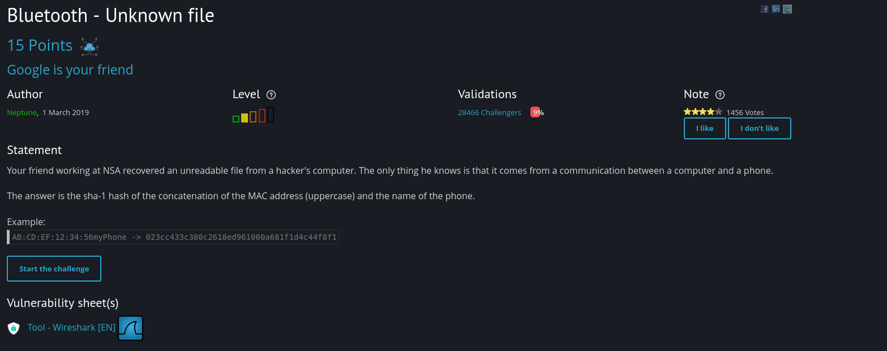
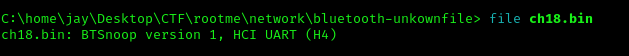
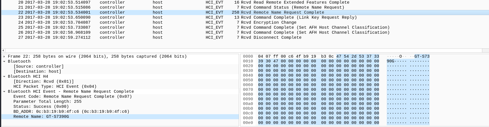
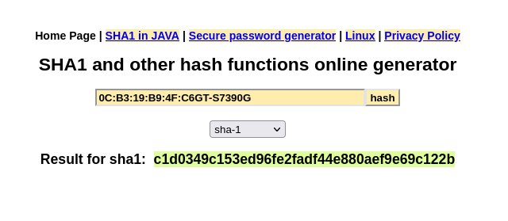

# Bluetooth - Unkown file

First, I want to know what type of file is this after I downloaded it.

After that, below the submit field, I noticed wireshark icon so I tried to open the file in wireshark.

At the left bottom part, I see an interesting info, and base on the challenge description, I need to find the MAC and the name of devide. So, I merged the two

Make it Uppercase
0c:b3:19:b9:4f:c6GT-S7390G -> 0C:B3:19:B9:4F:C6GT-S7390G

after that, I encoded it to sha-1 hash and then submit.

