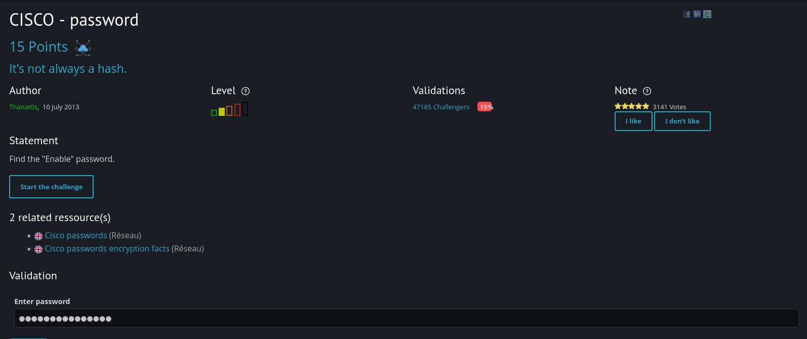
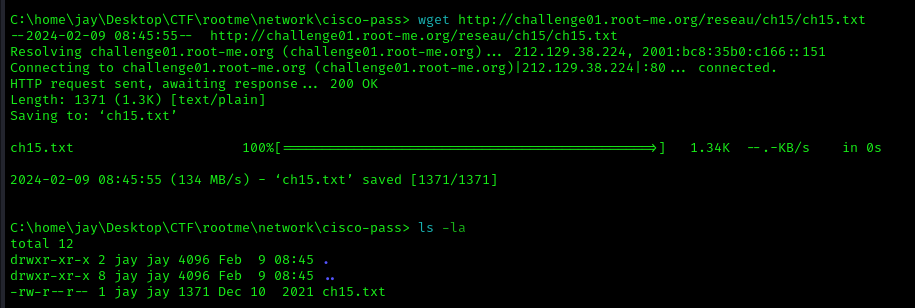
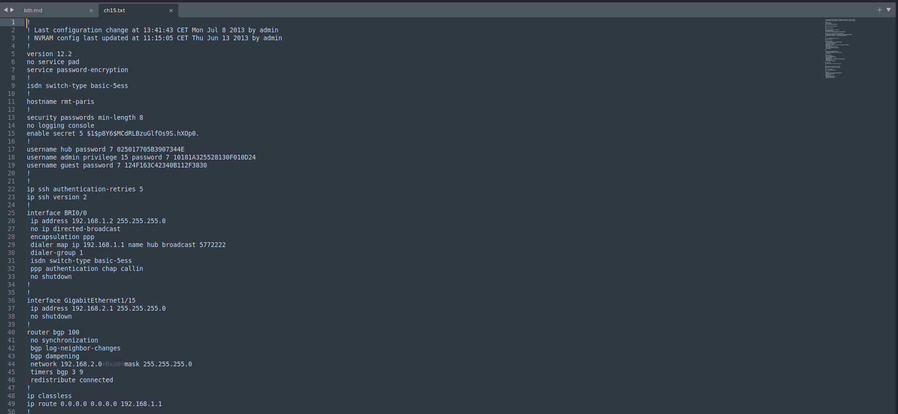
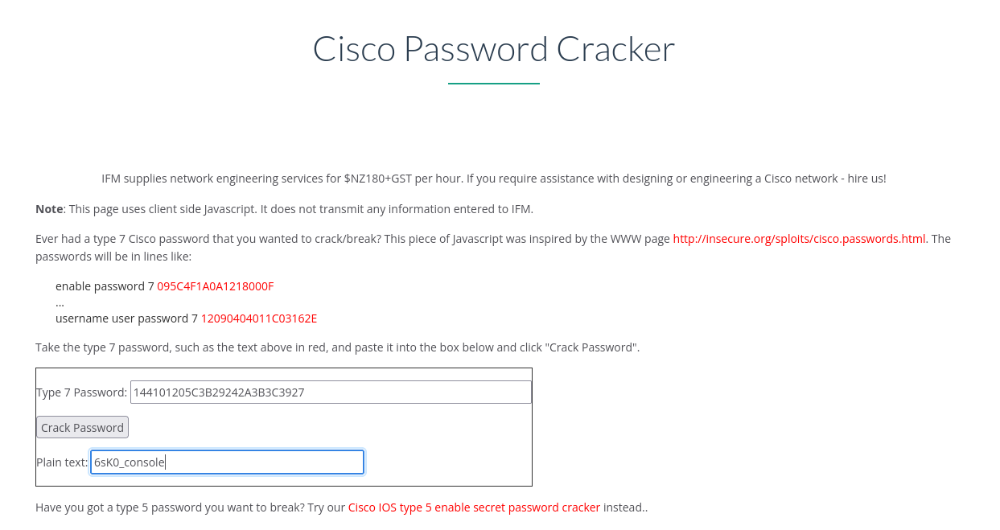
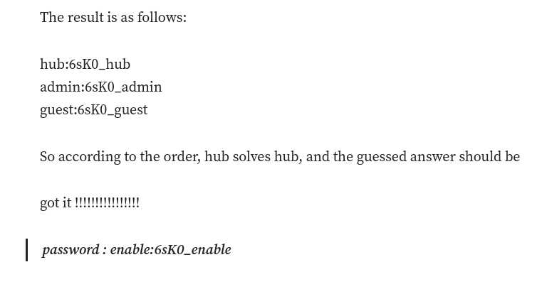

# Cisco - Password

For this challenge, I downloaded the file first 

And I found somethings interesting

Unfortunately, after reading documentation provided in the challenge and tried different approach, I didn't solve it. 
So, I viewed the writeup for this challenge and here is how he came up with the solution.

He used a cisco password cracker to cracked those passwords and here is what he found out

Though I did not solve the challenge this time, but I learned types of password and a new tool to crack cisco password. : )

