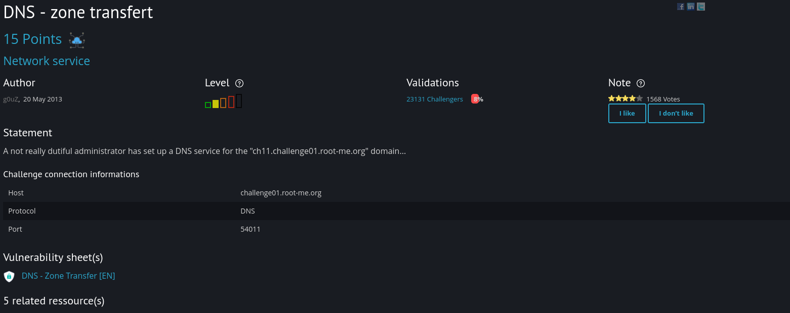
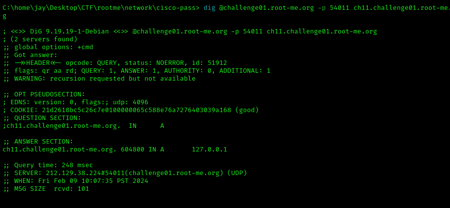
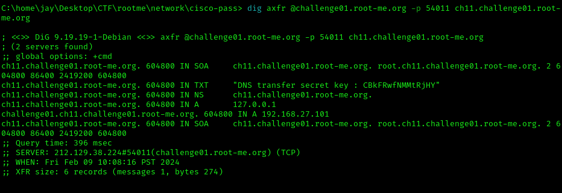

# DNS Zone Transfer

For this challenge, I read some documents about DNS zone transder since I don't have any idea what should I do to solve this challenge.
After reading some, I can perofrm zone transfer attack , so here is how I did it.

Here is the link: https://yogesh-verma.medium.com/zone-transfer-attacks-a-practical-guide-to-detection-and-prevention-2e8346d0297e

based on the challenge given description

Challenge connection informations
Host	challenge01.root-me.org
Protocol	DNS
Port	54011

I used dig tool to get information of the domain and here is what I found out. 

I tried to input the cookie in the submission bin but it is not the answer. I also tried to decode it and still failed. So, I browse back to the link again and I follow what he did

So, I did this (I added axfr to the command). 

Here, I saw a key, so I copy pasted it and it works!!!

Credits to  

