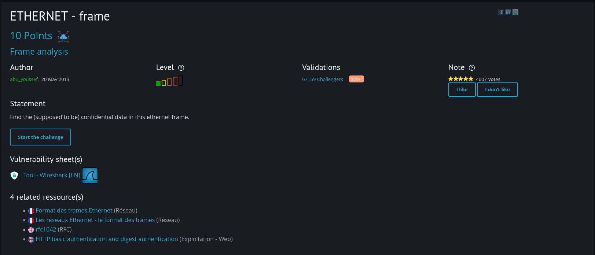
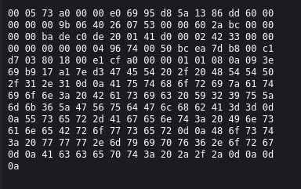
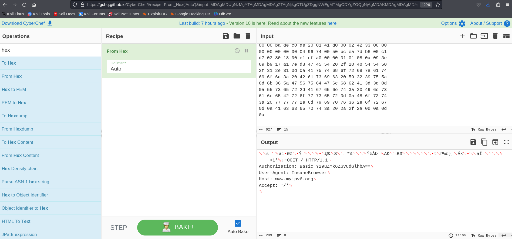
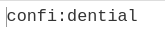

This one is a bit tricky. 

After clicking 'Start the Challenge,' I received the following text. And based on my observation, it appears to be encoded in hexadecimal. To decode it, I visited Cyberchef.

After decoding it, I obtained what seems to be an HTTP header. Considering the provided resources, it appears that the focus should be on 'authorization.' So, I copied the value of the authorization, which seems to be in base64 format. Upon decoding it, I found the answer.

