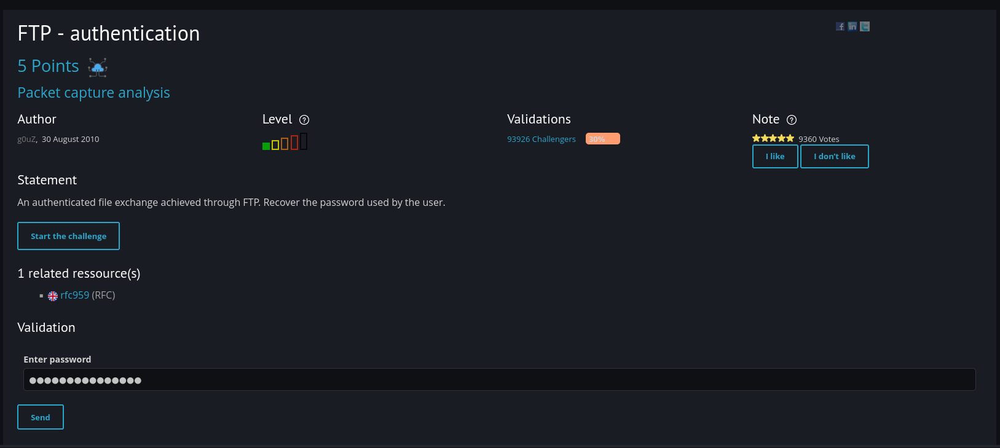
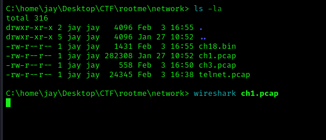
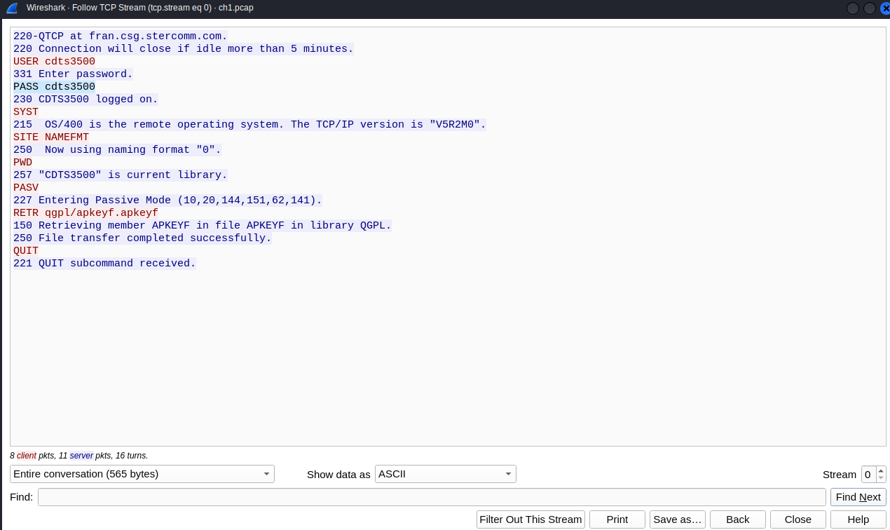

### FTP - authentication

So, what I did is I downloaded the pcap file by clicking the 'Start the Challenge' button.

Then, I opened it using Wireshark.

Next, I examined the stream by clicking on one of the packets and selecting 'Follow TCP Stream,' or simply using the shortcut (Ctrl+Alt+Shift+T).

Based on the given statement, I found the password and typed it into the submission box.

And that is it!

Pass: cdts3500