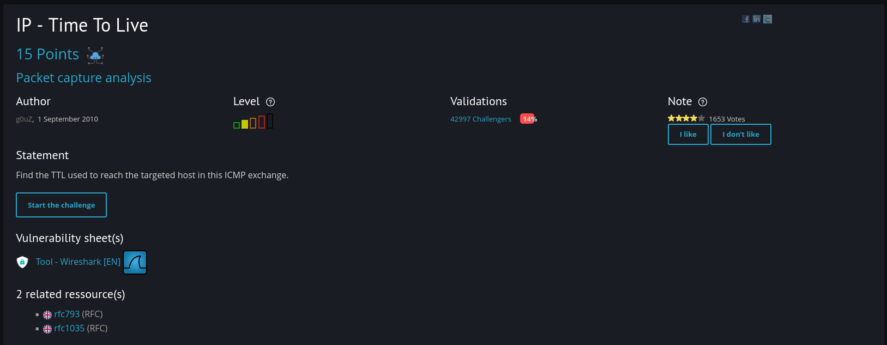
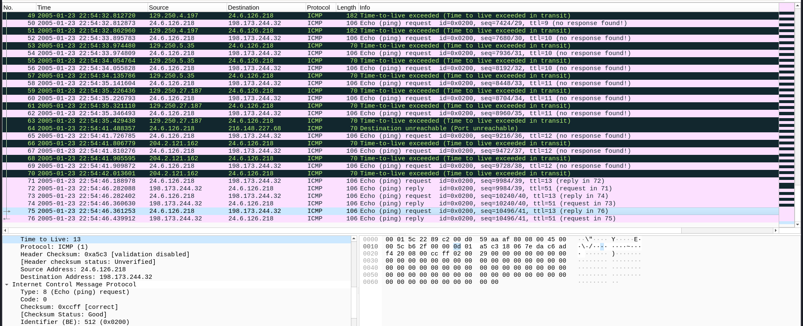

# IP - TTL 

This challenge is easy to solve.

So what I did here is I downloaded the file and open it with wireshark

Based on the challenge, I just need to submit the correct TTL (time to live) in the submission field 
and upon observing, I saw request and reply from the packets with ttl 13 and ttl 51 so I tried to submit the ttl 51 first
and its incorrect, so I tried to input "13" and it works!!!