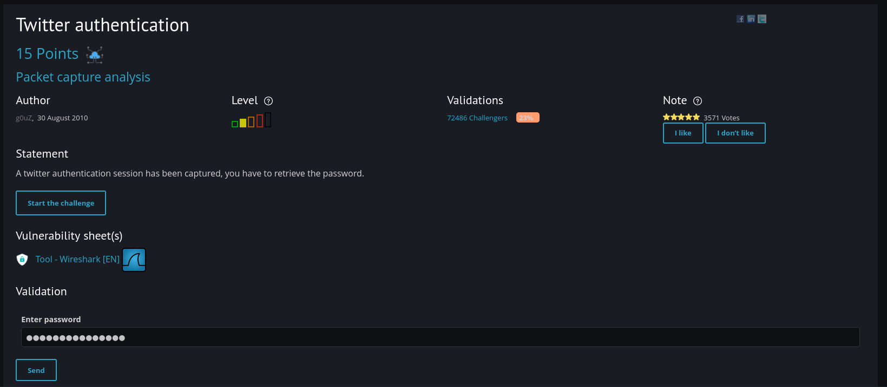
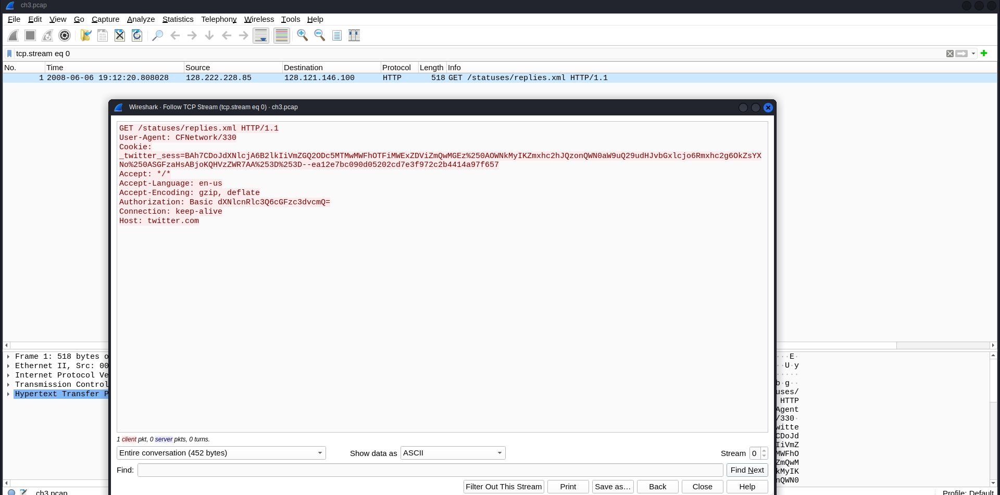
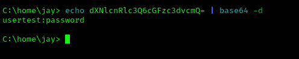

Based on the given statement, I needed to retrieve the password from the pcap file. Upon opening the pcap file, I found a specific packet, which I clicked on to follow the TCP stream.

Here, I noticed a base64-encoded text, so I copied it and decoded it.

